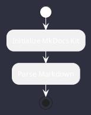
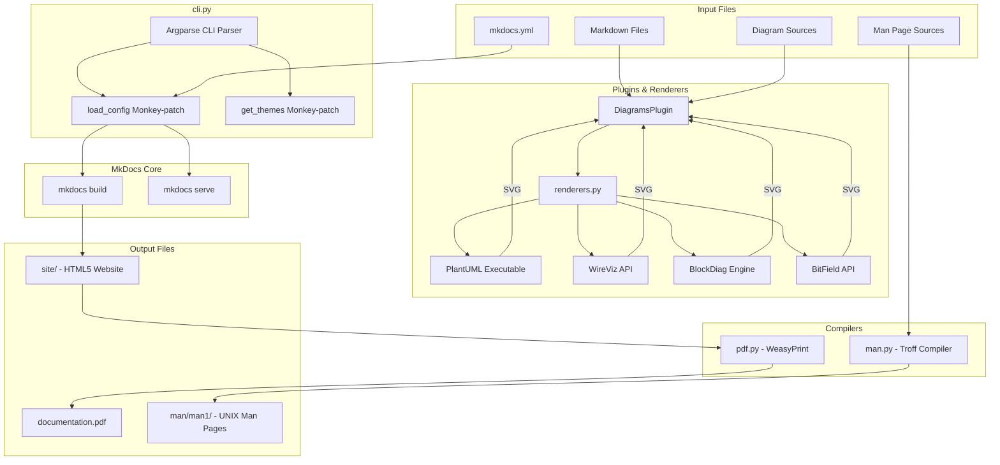

# MkDocs Kit: Single-Binary Documentation Environment

MkDocs Kit is a wrapped, highly integrated documentation generation environment compiled into a **single standalone binary**. It allows you to write documentation using Markdown and various diagram formats, and compile them locally into **HTML5, PDF, and UNIX Man Pages** without any external Python dependencies.

---

## Table of Contents
1. [User Manual](#user-manual)
   - [Installation & Setup](#installation--setup)
   - [Project Initialization](#project-initialization)
   - [Project Directory Structure](#project-directory-structure)
   - [Writing Content & Diagrams](#writing-content--diagrams)
   - [Writing UNIX Man Pages](#writing-unix-man-pages)
   - [Building Documentation](#building-documentation)
   - [Serving Locally](#serving-locally)
2. [Architectural Description](#architectural-description)
   - [System Architecture Diagram](#system-architecture-diagram)
   - [Core Component Breakdown](#core-component-breakdown)
   - [Runtime Monkey-Patching Architecture](#runtime-monkey-patching-architecture)
   - [Diagram Rendering Pipeline](#diagram-rendering-pipeline)
   - [PDF Compilation Engine](#pdf-compilation-engine)
   - [UNIX Man Page Compiler](#unix-man-page-compiler)
   - [PyInstaller Bundling & Packaging](#pyinstaller-bundling--packaging)
3. [Testing](#testing)

---

## User Manual

### Installation & Setup

#### Using the Standalone Binary (Recommended)
No installation is required. Simply download the compiled binary (`mkdocs-kit`) and run it directly on any compatible Linux system:
```bash
chmod +x mkdocs-kit
./mkdocs-kit --help
```

#### Running and Developing from Source
To run or develop from source, you must set up a Python 3.8+ environment:
```bash
# Create and activate virtual environment
python3 -m venv .venv
source .venv/bin/activate

# Upgrade pip and install pinned dependencies
pip install --upgrade pip
pip install "setuptools<82.0.0"  # Required for blockdiag compatibility
pip install mkdocs mkdocs-material weasyprint wireviz nwdiag bit_field pyinstaller

# Install the package in editable mode
pip install -e .
```

---

### Project Initialization

To bootstrap a new documentation project, use the `init` command followed by the target directory path. If no directory is specified, it defaults to the current directory:

```bash
./mkdocs-kit init my_project
cd my_project
```

The initialization command creates a fully configured template workspace demonstrating all supported diagram formats and man page generation.

---

### Project Directory Structure

A standard MkDocs Kit project consists of the following files:

```
my_project/
├── mkdocs.yml         # Main configuration file (auto-injected with DiagramsPlugin)
└── docs/              # Documentation source directory
    ├── index.md       # Welcome page
    ├── diagrams.md    # Showcase page containing PlantUML, WireViz, etc.
    └── man/           # Source directory for UNIX Man Pages
        └── mytool.1.md # Man page source file
```

---

### Writing Content & Diagrams

MkDocs Kit allows you to write standard Markdown and embed various diagram types directly into your pages using fenced code blocks. These diagrams are rendered locally to SVG and embedded inline.

#### 1. PlantUML
Used for standard UML diagrams (Sequence, Class, Activity, State, etc.).
```markdown

```

#### 2. WireViz
Used for documenting cabling, wiring harnesses, and connector pinouts using YAML syntax.
```markdown
```wireviz
connectors:
  A:
    type: DB9
    pinlabels: [TX, RX, GND]
  B:
    type: RJ45
    pinlabels: [RX, TX, GND]

connections:
  -
    - A: [1, 2, 3]
    - B: [2, 1, 3]
```
```

#### 3. RackDiag
Used for generating server rack layout diagrams.
```markdown
```rackdiag
rackdiag {
  rack {
    16U;
    1: UPS [webcolor = "red"];
    2-3: DB Server;
    4-5: Web Server;
    6: Switch;
  }
}
```
```

#### 4. PacketDiag
Used for visualizing network packet layouts, headers, and protocol fields.
```markdown
```packetdiag
packetdiag {
  colwidth = 32;
  0-15: Source Port;
  16-31: Destination Port;
  32-63: Sequence Number;
}
```
```

#### 5. ByteField
Used for binary bit/byte fields. You can write ByteField diagrams in three formats:
* **Lisp-like DSL** (Clojure-style):
  ```markdown
  ```bytefield
  (bytefield
    (draw-column-headers)
    (draw-box "Type" 8)
    (draw-box "Length" 16)
    (draw-box "Value" 8)
  )
  ```
  ```
* **YAML Format**:
  ```markdown
  ```bytefield
  - name: Type
    bits: 8
  - name: Length
    bits: 16
  - name: Value
    bits: 8
  ```
  ```
* **JSON Format**:
  ```markdown
  ```bytefield
  [
    {"name": "Type", "bits": 8},
    {"name": "Length", "bits": 16},
    {"name": "Value", "bits": 8}
  ]
  ```
  ```

---

### Writing UNIX Man Pages

To write a UNIX man page, create a Markdown file inside the `docs/man/` directory (or any Markdown file containing `man: true` or `man_section:` in its frontmatter).

#### Frontmatter Configuration
The file must start with a YAML frontmatter block containing the following metadata:
```markdown
---
title: mytool            # Command name (compiled to uppercase)
section: 1              # Man page section (1=Commands, 8=Sysadmin, etc.)
date: June 2026         # Manual publication date
version: 1.0.0          # Software version
manual: Utility Manual  # The header manual title
description: A tool description for the NAME section
---
```

#### Document Structure
Below the frontmatter, use standard Markdown headings. They will be translated into troff sections:
* `# MYTOOL(1) - Description` -> Sets up the `.TH` macro and `.SH NAME` section.
* `## SYNOPSIS` -> Translated to `.SH SYNOPSIS`. Use bold for commands and italics for variables.
* `## OPTIONS` -> Translated to `.SH OPTIONS`.
* Use bullet lists (`-`) or numbered lists (`1.`) for flags and parameter descriptions.

---

### Building Documentation

To compile your documentation workspace into HTML, PDF, and Man pages, run the `build` command:

```bash
# Build using default mkdocs.yml in current directory
./mkdocs-kit build

# Build using a custom config file and specify PDF output location
./mkdocs-kit build -c custom_config.yml -o dist/manual.pdf
```

#### Generated Outputs:
1. **HTML Documentation** (`site/`): A fully interactive website using the `material` theme.
2. **PDF Manual** (`documentation.pdf` and `site/documentation.pdf`): A printable manual compiled using WeasyPrint with A4 page sizes, margins, page numbers, running headers, and a cover page.
3. **UNIX Man Pages** (`man/` and `site/man/`): Compiled troff files organized into section subdirectories (e.g., `man/man1/mytool.1`). You can read them locally using the system `man` command:
   ```bash
   man ./man/man1/mytool.1
   ```

---

### Serving Locally

To preview your HTML documentation locally with automatic live-reloading as you modify Markdown files, run:

```bash
# Serve on default address (127.0.0.1:8000)
./mkdocs-kit serve

# Serve on a custom IP and port
./mkdocs-kit serve -a 0.0.0.0:8080
```

---

## Architectural Description

### System Architecture Diagram

The following diagram illustrates the internal components of MkDocs Kit and how data flows through the compilation pipeline:



---

### Core Component Breakdown

1. **`cli.py` (CLI Wrapper & Orchestrator)**:
   Acts as the central controller. It parses command-line arguments and invokes `mkdocs` commands (`build`/`serve`) programmatically. It applies critical monkey-patches at startup to enable seamless execution in a frozen environment.
2. **`plugin.py` (Markdown Interceptor)**:
   An MkDocs plugin (`DiagramsPlugin`) subclassing `BasePlugin`. It hooks into the `on_page_markdown` lifecycle stage, executing a regex scanner to locate fenced code blocks tagged with diagram languages and replacing them with rendered inline SVGs.
3. **`renderers.py` (Diagram Renderers)**:
   Contains the translation logic for each diagram language. It interfaces with Python APIs (`wireviz`, `rackdiag`, `packetdiag`, `bit_field`) and spawns isolated subprocesses for system-level binaries (`plantuml`).
4. **`pdf.py` (PDF Compiler)**:
   A post-build compiler that flattens the MkDocs navigation tree, reads the built HTML pages, extracts the core content blocks, adjusts relative paths, injects print-media CSS, and compiles the result into a single PDF document via WeasyPrint.
5. **`man.py` (Man Page Compiler)**:
   Scans the workspace for man page Markdown sources, parses their frontmatter and headings, and translates the Markdown syntax into standard Unix troff formatting.
6. **`templates.py` (Template Provider)**:
   Stores the raw file templates for initializing new projects, ensuring the tool remains entirely self-contained without needing external file reads.

---

### Runtime Monkey-Patching Architecture

To support freezing the entire environment into a single binary, several low-level monkey-patches are applied at startup in `cli.py`:

#### 1. Configuration Auto-Injection
To maintain a zero-configuration experience, the tool patches `mkdocs.config.load_config`. Whenever a configuration file is loaded, it checks if `mkdocs_kit_diagrams` is registered in the `plugins` list. If not, it instantiates and injects `DiagramsPlugin` programmatically:
```python
def patched_load_config(*args, **kwargs):
    config = original_load_config(*args, **kwargs)
    if 'mkdocs_kit_diagrams' not in config['plugins']:
        plugin = DiagramsPlugin()
        plugin.load_config({})
        config['plugins']['mkdocs_kit_diagrams'] = plugin
    return config
```

#### 2. PyInstaller Theme Discovery
MkDocs discovers themes using Python's `importlib.metadata` entry points. When frozen, PyInstaller does not expose these entry points. We patch `mkdocs.utils.get_themes` to inject a `MockMaterialEntryPoint`.
When `mkdocs` calls `load()` on the entry point, it returns a mock module whose `__file__` attribute points directly to the physical path inside the PyInstaller extraction directory (`sys._MEIPASS`):
```python
class MockMaterialEntryPoint:
    def __init__(self):
        self.name = 'material'
        self.value = 'material'
        self.group = 'mkdocs.themes'
    
    @property
    def dist(self):
        class MockDist:
            name = 'mkdocs-material'
        return MockDist()
        
    def load(self):
        class MockModule:
            pass
        m = MockModule()
        if hasattr(sys, '_MEIPASS'):
            m.__file__ = os.path.join(sys._MEIPASS, 'material', 'templates', '__init__.py')
        else:
            import material.templates
            m.__file__ = material.templates.__file__
        return m
```
Additionally, a dummy `cache_clear` lambda is attached to `patched_get_themes` to satisfy MkDocs' internal cache-clearing routine.

#### 3. Pillow 12 Backward Compatibility
Modern versions of Pillow (10+) removed the deprecated `ImageDraw.textsize` method in favor of `textbbox`. However, the `blockdiag` ecosystem (`rackdiag`, `packetdiag`) still calls `textsize` when rendering text. At startup, we check if `textsize` is missing from `PIL.ImageDraw.ImageDraw` and patch it:
```python
if not hasattr(PIL.ImageDraw.ImageDraw, 'textsize'):
    def patched_textsize(self, text, font=None, *args, **kwargs):
        bbox = self.textbbox((0, 0), text, font=font, *args, **kwargs)
        return (bbox[2] - bbox[0], bbox[3] - bbox[1])
    PIL.ImageDraw.ImageDraw.textsize = patched_textsize
```

---

### Diagram Rendering Pipeline

All diagrams are compiled **in-memory** to maximize performance and avoid disk I/O (with the exception of PlantUML, which requires a temporary file for the external Java process):

* **PlantUML**: The diagram source is written to a temporary file. A subprocess executes `plantuml -tsvg <temp_file>`. The resulting SVG file is read, and both temporary files are deleted.
* **WireViz**: Renders directly using the Python API:
  `wireviz.wireviz.parse(src, return_types='svg')`
* **RackDiag & PacketDiag**: Renders in-memory using the `blockdiag` drawing engine:
  ```python
  tree = parser.parse_string(src)
  diagram = builder.ScreenNodeBuilder.build(tree)
  draw = drawer.DiagramDraw('SVG', diagram)
  draw.draw()
  svg_content = draw.save()
  ```
* **ByteField**: The parser determines the input format. If it starts with `(`, it utilizes a lightweight Lisp lexer and recursive descent parser to convert the Clojure DSL into a Python list of dictionaries. Otherwise, it loads the string as JSON or YAML. The parsed dictionary is then rendered to SVG using:
  `bit_field.jsonml_stringify(bit_field.render(fields))`

---

### PDF Compilation Engine

The PDF compiler (`pdf.py`) combines all pages into a single high-quality document:
1. **Navigation Flattening**: Parses `mkdocs.yml` and flattens the hierarchical `nav` list into a sequential list of HTML file paths.
2. **Main Content Extraction**: Reads each HTML file and uses a regular expression to extract the inner HTML of the `<article>` tag (or `<div role="main">` fallback). This prevents the unescaping of HTML entities that occurs in standard parser-based tree-walking.
3. **Relative Path Adjustment**: For each page, relative paths in `src="..."` and `href="..."` attributes are resolved relative to the root directory (e.g. `img/diagram.svg` in a subdirectory becomes `docs/img/diagram.svg`).
4. **Master Document Assembly**: Wraps the combined content in a master HTML template containing a styled cover page and CSS print-media rules (A4 page sizes, 2cm margins, page numbers, and running headers).
5. **WeasyPrint Compilation**: Invokes WeasyPrint's `HTML(string=master_html, base_url=site_dir).write_pdf(pdf_output_path)`, using the site directory as the base URL to resolve all local assets.

---

### UNIX Man Page Compiler

The man page compiler (`man.py`) converts Markdown files into standard Unix troff manuals:
1. **Frontmatter Extraction**: Parses the YAML block at the beginning of the file to extract the title, section, date, version, and manual name.
2. **Header Setup**: Generates the `.TH` macro and the `.SH NAME` section.
3. **Heading Translation**: Translates `#` and `##` headings into `.SH` (Section Header) macros, and `###` into `.SS` (Subsection Header) macros.
4. **Formatting Translation**: 
   - Bold (`**text**` / `__text__`) is translated to `\fBtext\fR`.
   - Italics (`*text*` / `_text_`) is translated to `\fItext\fR`.
   - Inline code (`` `code` ``) is translated to `\fBcode\fR`.
   - Fenced code blocks are wrapped in `.nf` (no-fill) and `.fi` (fill) macros.
   - Lists (`-` or `1.`) are translated into `.IP \(bu 2` and `.IP 1. 2` indented paragraph macros.
5. **Directory Organization**: Writes the compiled troff files into directories corresponding to their man section (e.g. `man/man1/mytool.1`).

---

### PyInstaller Bundling & Packaging

To bundle the entire environment into a single executable, PyInstaller is invoked with the `--collect-all` flag for all critical packages:

```bash
pyinstaller --onefile --name mkdocs-kit \
  --collect-all mkdocs \
  --collect-all material \
  --collect-all weasyprint \
  --collect-all wireviz \
  --collect-all blockdiag \
  --collect-all rackdiag \
  --collect-all packetdiag \
  --collect-all nwdiag \
  --collect-all bit_field \
  src/mkdocs_kit/cli.py
```

* `--onefile`: Instructs PyInstaller to package everything into a single self-extracting executable. When run, it unpacks all Python modules and data files into a temporary directory (`/tmp/_MEIxxxxxx`, exposed in Python as `sys._MEIPASS`).
* `--collect-all <package>`: Collects all Python submodules, binary libraries, and data files (such as HTML templates, CSS, JS, and fonts) for the specified package.
  * Collecting `material` bundles all the HTML templates, assets, and icons for the theme.
  * Collecting `weasyprint` bundles its default stylesheets and configuration files.

---

## Testing

A comprehensive test suite is located in `tests/test_all.py`. It validates:
* In-memory rendering of all diagram formats (PlantUML, WireViz, RackDiag, PacketDiag, ByteField).
* Markdown-to-man compilation.
* End-to-end CLI `init` and `build` commands.

Run the tests using the virtual environment:
```bash
.venv/bin/python -m unittest tests/test_all.py
```
