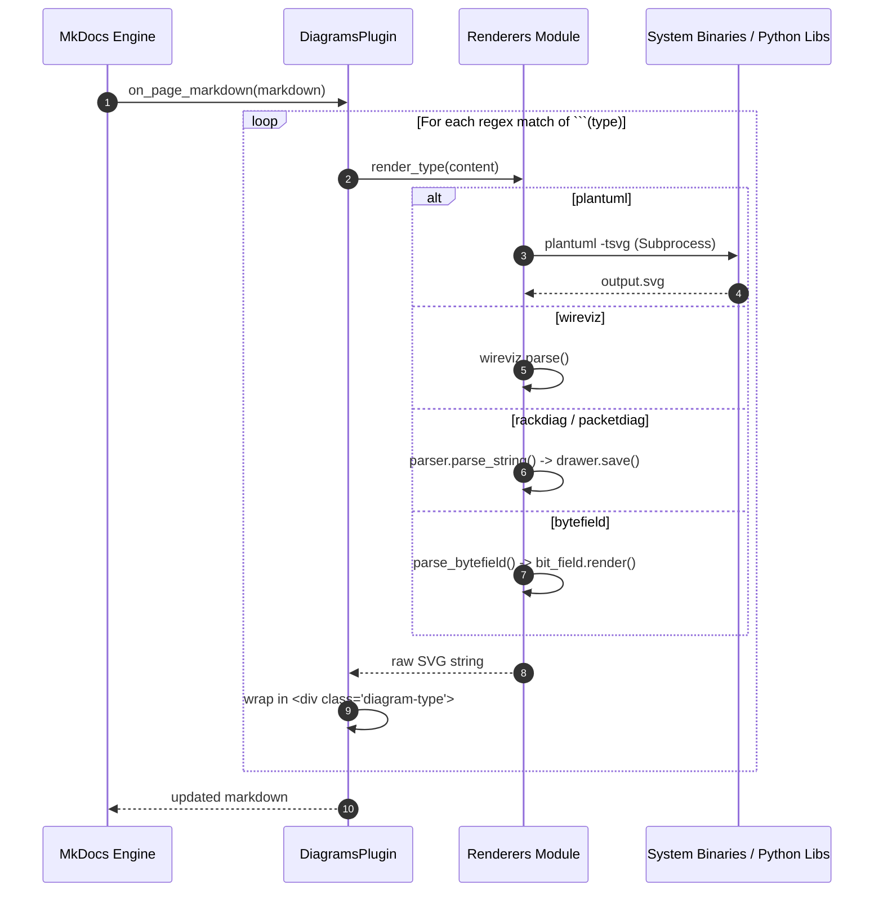

# ⚙️ Capabilities & Architecture Analysis

This section analyzes the architecture and design choices behind MkDocs-Kit.

---

## 🏗️ Architectural Breakdown

MkDocs-Kit is designed as a standalone wrapper extending standard MkDocs builds. It consists of the following modular sub-components:

```
┌────────────────────────────────────────────────────────────────────────┐
│                              mkdocs_kit                                │
├───────────────────┬───────────────────┬────────────────────────────────┤
│      cli.py       │      pdf.py       │            plugin.py           │
│  (Command Parser) │  (WeasyPrint PDF) │        (DiagramsPlugin)        │
└─────────┬─────────┴─────────┬─────────┴────────────────┬───────────────┘
          │                   │                          │
          ▼                   ▼                          ▼
┌───────────────────┐ ┌───────────────┐ ┌────────────────────────────────┐
│      man.py       │ │  templates.py │ │          renderers.py          │
│   (UNIX Man page) │ │ (Stylesheets) │ │ (Engine Processors & Wrappers) │
└───────────────────┘ └───────────────┘ └────────────────────────────────┘
```

---

## 🔄 Diagram Rendering Pipeline

The rendering lifecycle for custom diagrams integrates directly into the MkDocs build process:



---

## 📄 PDF Generation Engine

PDF rendering uses **WeasyPrint** to compile all documents sequentially.

### Features
1. **Zero-Copy Scaling**: All SVGs scale proportionally with native resolution preservation.
2. **Page Margin Control**: Automatic margin spacing avoiding clipped headers or footers.
3. **No stretches**: Using `.diagram-* svg { max-width: 100% !important; max-height: 22cm !important; width: auto !important; height: auto !important; object-fit: contain !important; }` prevents warp distortion.

---

## 🔍 Capability Matrix

| Feature | Supported Formats | Sub-dependencies | Execution Mode |
| :--- | :--- | :--- | :--- |
| **PlantUML** | UML (Sequence, Class, etc.) | System `plantuml`, Java | Subprocess |
| **WireViz** | Wiring harnesses | `wireviz` python package | In-process |
| **RackDiag** | Server rack layouts | `rackdiag` python package | In-process |
| **PacketDiag** | Network protocol packets | `packetdiag` python package | In-process |
| **ByteField** | Bit field diagrams | `bit_field` python package | In-process |
| **CSV Tables** | Data tables (paging, sort, filter) | `csv` & custom JS / filter engine | Dual (Interactive JS / Build-Time PDF) |
| **Plotly** | Interactive 2D/3D charts | Plotly.js / SVG generator | Dual (Interactive JS / Build-Time SVG) |
| **D3.js** | Data-driven vector graphics | D3 v7 / SVG vector engine | Dual (Interactive JS / Build-Time SVG) |
| **PDF Manual** | Publication-ready A4 PDF | `weasyprint` library | CLI sub-invocation |
| **Man Pages** | UNIX troff formatting | standard `re` parser | CLI sub-invocation |

