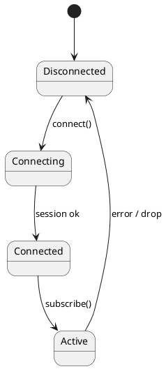

# Diagram Guide

MkDocs-Kit integrates **7 diagram engines** that render directly from fenced code blocks in your Markdown sources. No external build steps, no image files — the SVG output is embedded inline in every HTML page and PDF.

---

## Supported Engines at a Glance

| Engine | Block Fence | Best For | Renderer |
| :--- | :--- | :--- | :--- |
| **PlantUML** | ` ```plantuml ` | UML diagrams (Sequence, Class, Activity, Gantt…) | System `plantuml` binary |
| **WireViz** | ` ```wireviz ` | Cable harnesses and connector pinouts | `wireviz` Python package |
| **RackDiag** | ` ```rackdiag ` | Data center server rack layouts | `rackdiag` Python package |
| **PacketDiag** | ` ```packetdiag ` | Network protocol header field maps | `packetdiag` Python package |
| **ByteField** | ` ```bytefield ` | Hardware register and bit-field maps | `bit_field` Python package |
| **BlockDiag** | ` ```blockdiag ` | General-purpose block flow diagrams | `blockdiag` Python package |
| **NwDiag** | ` ```nwdiag ` | Network topology and subnet diagrams | `nwdiag` Python package |

---

## How It Works

During the MkDocs build, the `DiagramsPlugin` scans every Markdown page for fenced blocks whose language tag matches one of the above engines. It replaces each block with its rendered SVG output, wrapped in a `<div class="diagram-{type}">` container.

```
┌─────────────────────────┐       ┌──────────────────┐       ┌────────────────────┐
│   Markdown source file  │       │  DiagramsPlugin  │       │   HTML output page │
│                         │  -->  │  (on_page_mark-  │  -->  │                    │
│  ```plantuml            │       │   down hook)     │       │  <div class=       │
│  @startuml              │       │                  │       │   "diagram-        │
│  A -> B                 │       │  renderers.py    │       │    plantuml">      │
│  @enduml                │       │  render_plantuml │       │   <svg>…</svg>     │
│  ```                    │       │  → inline SVG    │       │  </div>            │
└─────────────────────────┘       └──────────────────┘       └────────────────────┘
```

The resulting SVGs scale correctly in both the HTML site and the PDF output (constrained to `max-height: 22cm` for A4 pages).

---

## Quick-Reference Example

Each engine section in this guide provides 2–3 realistic examples. Here is one from each engine:

### PlantUML — State Diagram



### RackDiag — Server Rack

```rackdiag
rackdiag {
  12U;
  1: Firewall [1U, color = red];
  2: Core Switch [1U, color = lightblue];
  3: App Server [2U, color = lightgreen];
  5: DB Server [2U, color = orange];
  7: NAS [2U];
}
```

### PacketDiag — UDP Header

```packetdiag
packetdiag {
  colwidth = 32;
  0-15: Source Port [color = lightblue];
  16-31: Destination Port [color = lightgreen];
  32-47: Length [color = lightyellow];
  48-63: Checksum [color = lightpink];
}
```

### BlockDiag — Build Pipeline

```blockdiag
{
  Commit -> Build -> Test -> Package -> Deploy;
  Build -> Lint -> Package;
}
```

### NwDiag — Network Topology

```nwdiag
{
  network lan {
    address = "10.0.0.0/24";
    server [address = "10.0.0.10"];
    client [address = "10.0.0.20"];
  }
}
```

---

## Per-Engine Detailed Pages

See the individual pages in the **Diagrams** section of the navigation for comprehensive examples, syntax references, and rendering tips for each engine.
