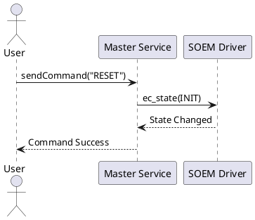

# 📊 Diagram Guide

This guide details the supported diagram formats and provides syntax examples for each engine.

---

## 1. PlantUML (`plantuml`)

PlantUML is a highly versatile diagramming tool for creating UML diagrams.

### Example Sequence Diagram


---

## 2. WireViz (`wireviz`)

WireViz is a tool for documenting cables, wiring harnesses, and connector pinouts using YAML syntax.

### Example Wiring Diagram
```wireviz
connectors:
  J1:
    type: DB9
    pinlabels: [TX, RX, GND]
  J2:
    type: DB9
    pinlabels: [RX, TX, GND]

cables:
  W1:
    wirecount: 3
    color: [red, black, green]

connections:
  -
    - J1: [1, 2, 3]
    - W1: [1, 2, 3]
    - J2: [2, 1, 3]
```

---

## 3. RackDiag (`rackdiag`)

RackDiag generates ASCII/Unicode-art rack diagrams.

### Example Server Rack Layout
```rackdiag
{
  rack {
    1U: UPS
    2U: DB Server
    1U: Web Server [color = lightgreen]
    1U: Switch
  }
}
```

---

## 4. PacketDiag (`packetdiag`)

PacketDiag generates network packet header field maps.

### Example Packet Structure
```packetdiag
{
  colwidth = 32
  node_height = 24

  0-15: Source Port
  16-31: Destination Port
  32-63: Sequence Number
}
```

---

## 5. ByteField (`bytefield`)

ByteField renders bit-field and byte-field diagrams. It accepts three inputs: a Lisp-like DSL, JSON, or YAML.

### Option A: Lisp-like DSL
```bytefield
(bytefield
  (draw-column-headers)
  (draw-box "Version" 4)
  (draw-box "IHL" 4)
  (draw-box "Type of Service" 8)
  (draw-box "Total Length" 16)
  (draw-gap "Payload")
)
```

### Option B: JSON Format
```bytefield
[
  {"name": "Version", "bits": 4},
  {"name": "IHL", "bits": 4},
  {"name": "Type of Service", "bits": 8},
  {"name": "Total Length", "bits": 16}
]
```

### Option C: YAML Format
```bytefield
- name: Version
  bits: 4
- name: IHL
  bits: 4
- name: Type of Service
  bits: 8
- name: Total Length
  bits: 16
```
