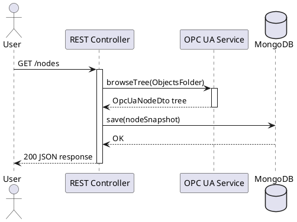
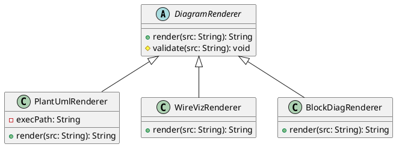
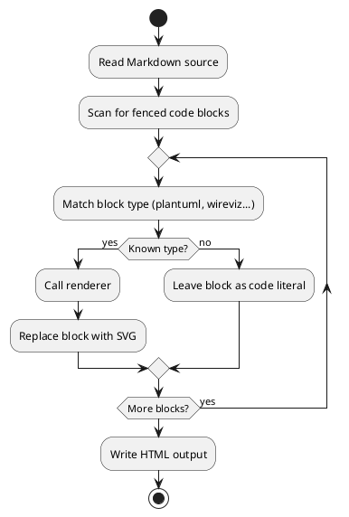
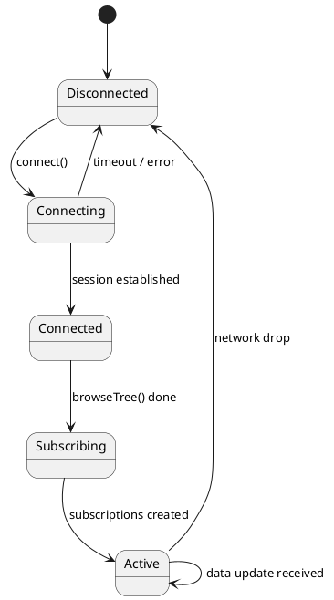
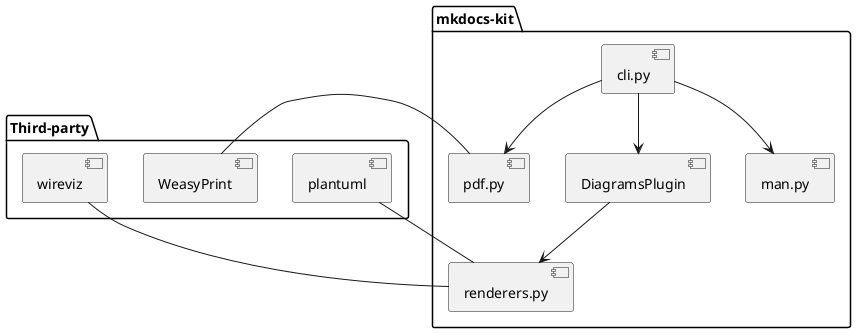
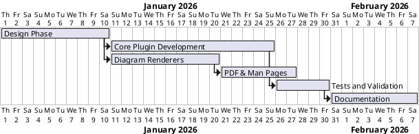
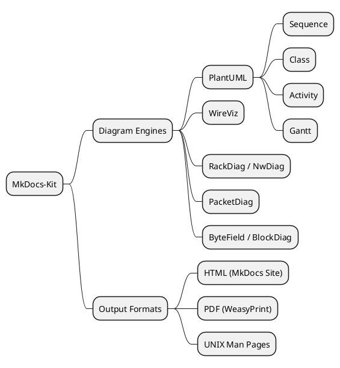

# PlantUML Diagrams

PlantUML is a text-based diagramming tool that supports 13 distinct diagram types. Blocks use the `plantuml` fence identifier and must begin with `@startuml` / `@enduml` (or the equivalent for non-UML types).

---

## Sequence Diagram

Models the chronological interaction between system actors. Useful for documenting API call flows and inter-service communication.

---

## Class Diagram

Captures the static structure of a system — classes, attributes, methods, and relationships.

---

## Activity Diagram

Represents the flow of control in a process — ideal for documenting build pipelines and data transformation steps.

---

## State Diagram

Documents the lifecycle of a connection or object — perfect for documenting OPC UA connection states.

---

## Component Diagram

Shows the software component relationships and interfaces in an architecture.

---

## Gantt Diagram

A scheduling tool for representing project timelines with tasks and dependencies.

---

## MindMap

A radial structure for capturing and organizing related concepts.

