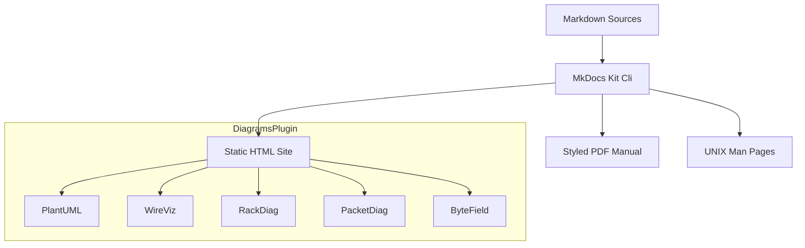

# 🛠️ MkDocs-Kit

Welcome to the official documentation for **MkDocs-Kit**!

MkDocs-Kit is a high-performance, container-ready compilation toolchain designed for technical writers and engineering teams. It streamlines the generation of multi-format documentation (HTML, publication-quality A4 PDF manuals, and native UNIX Man pages) from a single source of Markdown files.

---

## 🌟 Key Features

* **🔌 Custom Diagrams Extension**: Seamlessly render complex inline technical diagrams directly in your documentation using simple markdown code blocks (PlantUML, WireViz, RackDiag, PacketDiag, ByteField).
* **📄 Publication-Quality PDF Manuals**: Automated conversion of your Markdown content into a single, beautifully styled A4 PDF manual using WeasyPrint with custom print stylesheets.
* **🐧 UNIX Man Page Generation**: Extract reference sections and export them directly to the native `man` format for command-line documentation.
* **🌐 Local-First Architecture**: Disables directory URLs to ensure that locally viewed HTML links resolve correctly without running a web server.

---

## 🏗️ Core Pillars



---

## 🚀 Quick Start

### 1. Installation
Install MkDocs-Kit directly from GitHub:
```bash
pip install git+https://github.com/mlecabellec/mkdocs-kit.git
```

### 2. Add to Your MkDocs Project
Enable the custom Diagrams plugin in your `mkdocs.yml`:
```yaml
plugins:
  - search
  - mkdocs_kit.plugin: {}
```

### 3. Build Your Documentation
Compile your markdown files into HTML, PDF, and Man pages:
```bash
python3 -m mkdocs_kit.cli build
```
