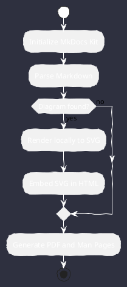

# Diagram Showcase

This page showcases the diagram engines integrated into this kit. All diagrams are rendered locally to SVG and embedded directly in the HTML and PDF outputs.

## PlantUML



## WireViz

```wireviz
connectors:
  A:
    type: DB9
    pinlabels: [TX, RX, GND]
  B:
    type: RJ45
    pinlabels: [RX, TX, GND]

cables:
  W1:
    wirecount: 3

connections:
  -
    - A: [1, 2, 3]
    - W1: [1, 2, 3]
    - B: [2, 1, 3]
```

## RackDiag

```rackdiag
rackdiag {
  rack {
    16U;
    1: UPS [color = "red"];
    2: DB Server [2U];
    4: Web Server [2U];
    6: Switch;
  }
}
```


## PacketDiag

```packetdiag
packetdiag {
  colwidth = 32;
  0-15: Source Port;
  16-31: Destination Port;
  32-63: Sequence Number;
  64-95: Acknowledgment Number;
}
```

## ByteField

You can write ByteField diagrams using Clojure-like Lisp DSL, JSON, or YAML.

### Lisp-like DSL
```bytefield
(bytefield
  (draw-column-headers)
  (draw-box "Type" 8)
  (draw-box "Length" 16)
  (draw-box "Value" 8)
)
```

### YAML Format
```bytefield
- name: Type
  bits: 8
- name: Length
  bits: 16
- name: Value
  bits: 8
```
