# PlantUML Diagrams

This page demonstrates the 13 main diagram types supported by the PlantUML engine, as documented on [plantuml.com/fr/](https://plantuml.com/fr/).

---

## 1. Diagramme de Séquence (Sequence Diagram)
Used to show interactions between actors and objects in a chronological sequence.

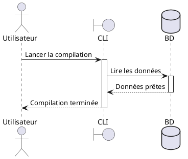

## 2. Diagramme de Cas d'Utilisation (Usecase Diagram)
Describes the relationships between actors and the system's use cases.

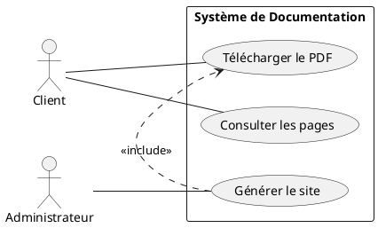

## 3. Diagramme de Classes (Class Diagram)
Shows the static structure of the system, including classes, attributes, methods, and relationships.

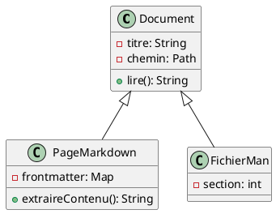

## 4. Diagramme d'Activité (Activity Diagram)
Represents the flow of control or data within a system or process.

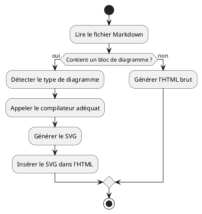

## 5. Diagramme de Composants (Component Diagram)
Illustrates how the system's software components are organized and their dependencies.

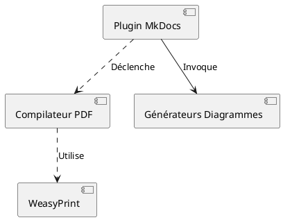

## 6. Diagramme d'État (State Diagram)
Describes the behavior of a system or object by showing its states and transitions.

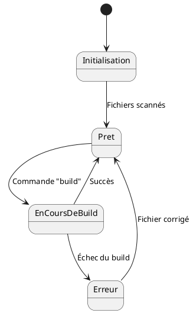

## 7. Diagramme d'Objets (Object Diagram)
Shows instances of classes and their concrete relationships at a specific point in time.

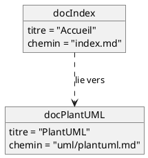

## 8. Diagramme de Déploiement (Deployment Diagram)
Models the physical deployment of artifacts on nodes (hardware or software execution environments).

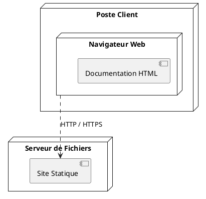

## 9. Diagramme de Temps (Timing Diagram)
Used to show the state changes of one or more lifelines over a timeline.

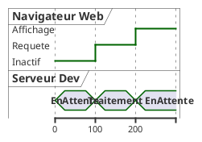

## 10. Diagramme de Gantt (Gantt Diagram)
A bar chart that illustrates a project schedule.

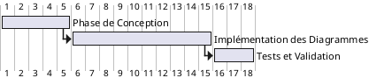

## 11. MindMap (Carte Mentale)
A graphical way to represent ideas and concepts around a central theme.

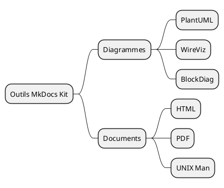

## 12. WBS (Work Breakdown Structure)
A hierarchical decomposition of the total scope of work to be carried out by the project team.

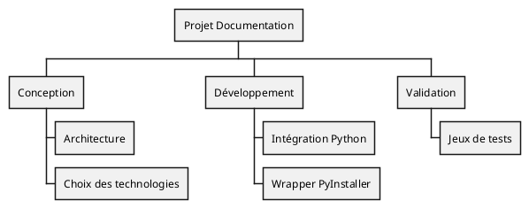

## 13. Diagramme Réseau (Network Diagram / NwDiag)
Visualizes network topologies, subnets, and IP addresses.

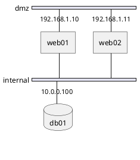

